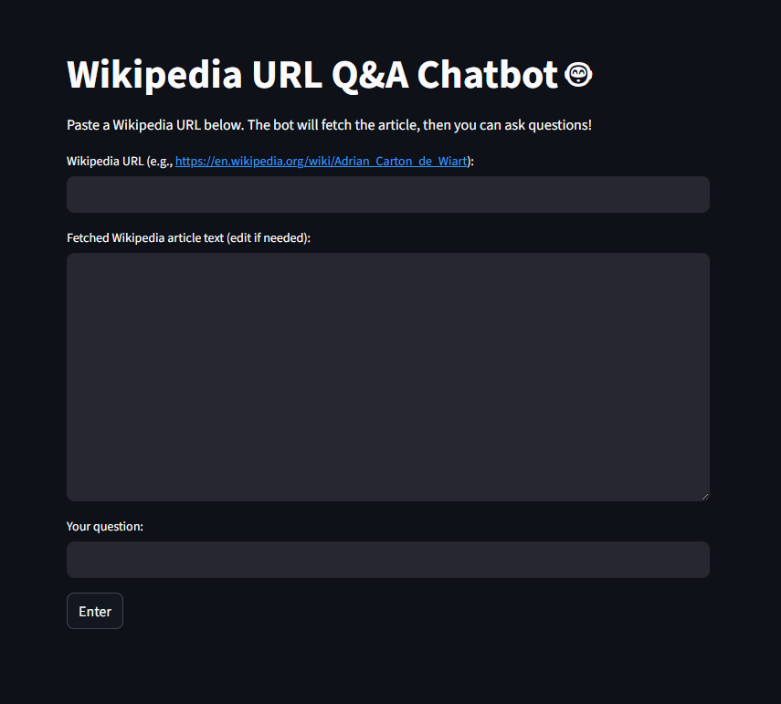

# Wikipedia Chatbot 🤖

A simple Streamlit app to ask questions about any Wikipedia article using Google's Gemini LLM!  
Just enter a Wikipedia URL, let the app fetch the article, and enjoy context-aware answers from Gemini.

---

## How to Use

1. **Open the app link** provided by the maintainer (you may see this hosted on Streamlit Cloud).

2. **Paste a Wikipedia article URL** (for example: `https://en.wikipedia.org/wiki/Adrian_Carton_de_Wiart`) into the input field, then click to load.

3. **Review or edit the loaded Wikipedia text**  
   The article content is displayed in a text box; feel free to adjust or trim it as needed.

4. **Ask your question**  
   Type your question into the question box and click "Enter".

5. **Read the AI answer**  
   Gemini will answer solely using the information from the loaded Wikipedia article.

**Tips:**
- For best results, ask questions relevant to the loaded article.
- You can load new articles and repeat Q&A as much as you like.
- If your question isn’t answerable from the provided article, Gemini will let you know.

---

## Demo

---

## Credits

- [Google Generative AI API](https://ai.google.dev/)
- [Streamlit](https://streamlit.io/)
- [Wikipedia API](https://en.wikipedia.org/w/api.php)

---

*Made with ❤️ by:*
#### Garvit Ghiya
**[LinkedIn](https://www.linkedin.com/in/garvit-ghiya/)**
**[GitHub](https://github.com/Garvit893)**
